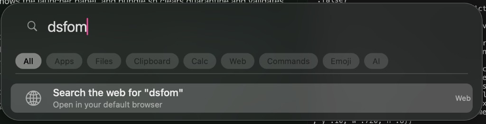
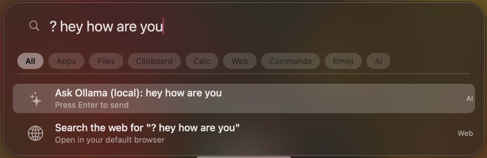
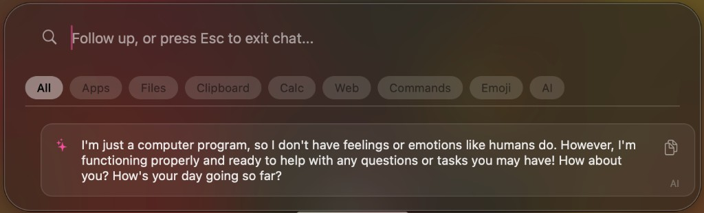
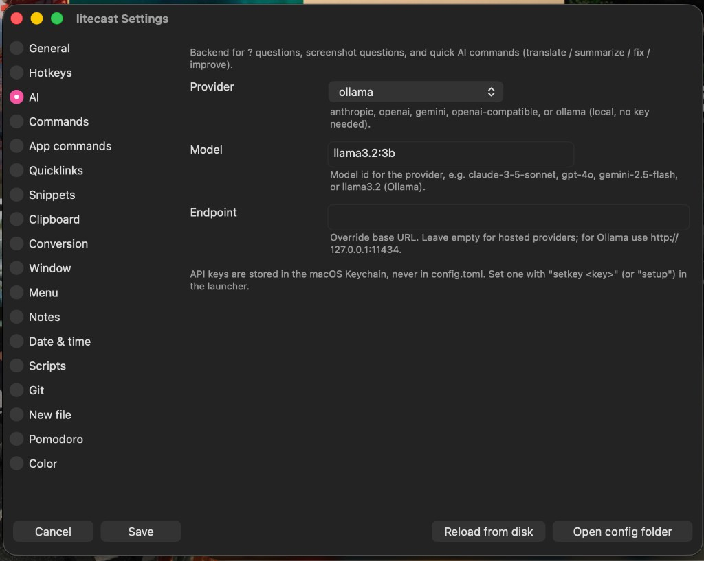

<p align="center">
  
</p>

# litecast

A super-lightweight, native keyboard launcher for macOS, written in Rust.

litecast shows a Dock icon and a menu-bar extra, and pops up a borderless search
panel on a global hotkey. It is built directly on AppKit via
[`objc2`](https://crates.io/crates/objc2) (no web view, no cross-platform UI toolkit),
so it stays fast and lean. The launcher-first workflow is unchanged: the hotkey still
toggles the panel; the Dock icon and menu bar are there for discoverability and Settings.

## Screenshots

The borderless search launcher with category filters, showing app and file
results for a fuzzy query:



Ask the AI right from the launcher — type `? your question` to query your local
Ollama model (or any configured provider):



The AI answer renders inline, and you can keep typing to continue the chat with
a follow-up prompt:



The native, resizable Settings window — here on the AI tab, with the provider
set to Ollama and a local model:



## Goals

- Concise, performant, minimal CPU overhead.
- Native AppKit UI (an `NSPanel`), idle when hidden.
- Prefer hand-rolled implementations for small features; only depend on a crate when it
  is genuinely leaner or faster than what we'd write.

## Features

- Global hotkey to toggle the search panel.
- Recents on open - an empty query shows this session's recent activity and last AI answer (in-memory, never persisted).
- Fuzzy app launcher.
- File search (backed by the macOS file index via `mdfind`).
- Category filters - scope results by clicking a chip, typing an `@` prefix, or cycling with Tab.
- Frecency ranking - frequently and recently used items drift to the top.
- Inline calculator (hand-rolled evaluator).
- Unit & currency conversion (`10 km in mi`, `100 usd to eur`).
- Developer tools - base64, URL encode/decode, MD5/SHA-1/SHA-256, UUID v4, random passwords, lorem ipsum, JSON pretty/minify (all hand-rolled, no network).
- Color, number-base & timestamp converters (`#ff8800`, `255 to hex`, `epoch 1700000000`).
- Date & time - world clock (`time in Tokyo`), date math (`days until 25 Dec`), and non-blocking timers (`timer 5m`).
- System commands (lock, sleep, dark mode, volume, Wi-Fi, Bluetooth, brightness, caffeinate, eject, Focus, empty trash, restart, ...).
- File power actions (`reveal`, `ql`, `copypath`, `folder`) plus `recent` and `downloads` listings.
- Calendar & reminders (`today`/`agenda`, `remind ...`, `event ...`) via AppleScript.
- Network info (`ip`, `myip`, `ports`, `port <n>`, `wifi networks`).
- Quick notes (`note <text>`) to a plain-text file, optionally mirrored to Apple Notes.
- Offline dictionary & spell (`define <word>`, `spell <word>`).
- Media controls (`play`, `pause`, `next`, `prev`, `now playing`) for Spotify/Music.
- Emoji & symbol picker (the `emoji` keyword or a `:` prefix).
- Text snippets (the `snip` keyword).
- Quicklinks - parameterized `{query}` URLs.
- Web-search fallback (opens the default browser).
- Clipboard history with pins and text/link/image types (the `clip` keyword).
- Browser bookmark/history search (`bm` / `hist`) for Chrome, Brave, Edge, Chromium, Vivaldi.
- Process manager (`kill` / `ps`) - confirm-then-SIGTERM your own processes.
- Window management (opt-in; needs Accessibility) - snap/resize the frontmost window with `win`.
- User-defined custom commands (with aliases) + an external [plugin protocol](docs/plugins.md).
- App commands - `@keyword` actions that take a free-text argument (`@term`, `@finder`, `@safari`, plus your own), with `@`-autocomplete and Tab to accept.
- Custom global hotkeys - bind any combo to open a URL, run a shell command, or fire a named command.
- AI query (Anthropic Claude / OpenAI / Google Gemini / any OpenAI-compatible endpoint), with API keys stored in the macOS Keychain.
- Multi-turn AI follow-up chat and quick AI commands (translate / summarize / fix grammar / improve).
- Screenshot capture sent to an AI vision model.
- Small, opt-out UI delights (playful placeholders, fade-in, easter eggs, wandering critters).
- Native, resizable Settings window with a sidebar, in-app help for every setting, a hotkey recorder, and an opt-in "Launch at login".

## Hotkeys

- `Option + Space` - toggle the launcher panel (configurable; see below).
- `Option + Shift + Space` - capture a screen region and ask the AI about it.
- `Cmd + 1 … 9` - while the panel is open, select the Nth category chip
  (`Cmd+1` = All, `Cmd+2` = Apps, `Cmd+3` = Files, …), Spotlight-style.
- `Tab` / `Shift+Tab` cycle the category filter; arrow keys move the selection;
  `Enter` activates; `Esc` clears a filter, then closes.

### Changing the toggle hotkey (and using Cmd + Space)

The easiest way is in **Settings → Hotkeys**: click the **Toggle panel** recorder,
press your combo, and **Save**. You can also edit `config.toml` directly:

```toml
[hotkey]
toggle = "Cmd+Space"
screenshot = "Cmd+Shift+Space"
```

Combo syntax is `modifiers + key` (modifiers: `Cmd`/`Command`/`Super`,
`Ctrl`, `Alt`/`Option`, `Shift`). At least one modifier is required.

To use **Cmd + Space**, first free it from Spotlight:

1. Open **System Settings → Keyboard → Keyboard Shortcuts… → Spotlight**.
2. Uncheck **Show Spotlight search** (the `⌘Space` binding). Optionally also
   uncheck **Show Finder search window** (`⌥⌘Space`).
3. Set `toggle = "Cmd+Space"` in `[hotkey]` and restart litecast.

Option+Space keeps working out of the box if you'd rather not touch Spotlight.

You can also define your own global hotkeys in the config via `[[hotkeys]]` (see
[Custom global hotkeys](docs/features.md#custom-global-hotkeys) for the combo
syntax), each bound to open a URL/app, run a shell command, or fire a named
command — without opening the panel.

## Settings

litecast ships with a native Preferences window that edits every section of the
config. Open it from the **litecast** app menu → **Settings…** (`⌘,`), from the
menu-bar extra → **Settings…**, or from a terminal with:

```bash
litecast --preferences
```

The window has a **sidebar** listing every config section — **General**,
**Hotkeys**, **AI**, **Commands**, **App commands**, **Quicklinks**, **Snippets**,
**Clipboard**, **Conversion**, **Window**, **Menu**, **Notes**, **Date & time**,
**Scripts**, **Git**, **New file**, **Pomodoro**, and **Color** — so all sections
are always reachable (click one to switch panes). The window is **resizable**
(drag any edge); the sidebar and content pane grow with it, and tall sections
scroll. Under each setting there is a short **gray help caption** explaining what
the field does and giving example values.

Highlights:

- **Launch litecast at login** (General): a checkbox that registers a per-user
  LaunchAgent so litecast starts automatically after you log in. The checkbox
  reflects the real current state when the window opens, and toggling it takes
  effect immediately (applies on the next login).
- **Hotkey recorder** (Hotkeys): click the **Toggle panel** or **Screenshot**
  recorder and press your combo (e.g. ⌘Space). It captures and displays the
  shortcut. If a combo can't be registered (already owned by another app, e.g.
  Spotlight owns ⌘Space), Save shows an inline warning telling you how to free it.

Editing a value and pressing **Save** applies it immediately — the query engine is
rebuilt and global hotkeys are re-registered without restarting the app. **Cancel**
reverts the in-memory draft, **Open config folder** reveals the config in Finder,
and **Reload from disk** re-reads `config.toml` if you edited it externally.

> **Note:** the source of truth is still
> `~/Library/Application Support/litecast/config.toml`. Saving from Preferences
> rewrites that file via `toml`, which does **not** preserve inline `#` comments.
> API keys are never written to the TOML — they stay in the macOS Keychain (set them
> with `setkey` / `setup` in the launcher).

## Usage

Open the panel and start typing:

- Open the panel and leave the query empty to see recent items and your last AI answer; pick one to re-run or reopen it.
- Type an app or file name to launch/open it.
- Type a math expression (e.g. `12 * (3 + 4)`) for an instant result.
- Convert units or currency: `10 km in mi`, `100 f to c`, `100 usd to eur`.
- Search a system command by name: `lock`, `sleep`, `dark`, `wi-fi`, `trash`, `caffeinate`, `eject`, `volume 50`, ...
- Developer tools: `base64 hello`, `sha256 secret`, `uuid`, `password 24`, `json {"a":1}`.
- Convert a color or base or timestamp: `#ff8800`, `255 to hex`, `epoch 1700000000`.
- Date & time: `time in Tokyo`, `days until 25 Dec`, `timer 10m tea`.
- Network: `ip`, `myip`, `ports`, `port 3000`, `wifi networks`.
- Files: `recent`, `downloads`, `reveal ~/Desktop/file.txt`, `copypath ~/notes`.
- Calendar: `today`, `remind buy milk at 5pm`, `event Lunch at 1pm`.
- Notes: `note remember to call back`, then `notes` to open the file.
- Look things up: `define ephemeral`, `spell recieve`.
- Media: `play`, `pause`, `next`, `now playing`.
  Destructive ones (empty trash, restart, shut down) need a second `Enter` to confirm.
- Type `emoji fire` or `:fire` to find and copy an emoji/symbol.
- Type `snip` to browse text snippets (or a snippet's own keyword); `Enter` copies it.
- Use a quicklink keyword with an argument (e.g. `ghr rust-lang/rust`).
- Type `clip` to browse clipboard history (`clip foo` to filter; `clip pin <n>` to pin). Links open, images re-copy.
- Type `bm <query>` to search browser bookmarks, or `hist <query>` for browser history.
- Type `kill` or `ps` (optionally `kill safari`) to list processes; `Enter`, then `Enter` again, sends SIGTERM.
- Type `win` (e.g. `win left`, `win right`, `win max`) to snap the frontmost window (needs Accessibility; enabled by default, disable with `[window] enabled = false`).
- Type `? your question` to ask the configured AI backend, then keep typing to continue the chat (Esc exits chat).
- Quick AI commands: `translate`/`tr`, `summarize`/`sum`, `fixgrammar`/`fix`, `improve` (use an argument or the clipboard).
- Type `setup` for a guided AI-key walkthrough, or `setkey <api-key>` to store the API key for the active AI backend in the Keychain.
- Anything else offers a web search.

Frequently and recently activated results are automatically boosted toward the top.

### Getting started / setting your AI key

The AI features (the `?` ask, the screenshot question, and the quick AI
commands) need an API key for your chosen provider. Setup is in-app and takes a
few seconds:

1. Open the panel and type **`setup`**. litecast shows your active provider,
   links to that provider's key page (press `Enter` to open it), and the exact
   next steps.
2. Create a key on the provider's site (Anthropic Console, OpenAI Platform, or
   Google AI Studio).
3. Back in litecast, type **`setkey <your-api-key>`** and press `Enter`. The key
   is stored in the macOS **Keychain** (service `litecast`, under the active
   provider) — never in a config file.
4. Ask anything with **`? your question`**.

If you try `? …` before setting a key, litecast shows a friendly hint and can
open the key page for you. To switch providers, change `provider` in `[ai]` and
`setkey` that provider's key. Run `setup` again any time to re-check status or
replace a key.

### AI providers

Pick a backend in the `[ai]` section of the config. Supported `provider` values:

- `anthropic` - Anthropic Claude (Messages API).
- `openai` - OpenAI chat-completions.
- `gemini` - Google Gemini (Generative Language API). `google` is an alias.
- `openai-compatible` - any OpenAI-compatible endpoint via the `endpoint`
  override. `cursor` still works as a legacy alias for this.

Example Gemini config:

```toml
[ai]
provider = "gemini"
model = "gemini-2.5-flash"
endpoint = ""   # leave empty; only set this to point at a proxy
```

Get a Gemini key from Google AI Studio (https://aistudio.google.com). Gemini can
alternatively be reached through its OpenAI-compatible endpoint using
`provider = "openai-compatible"` with the appropriate `endpoint`.

Keys are never stored in config files: run `setkey <api-key>` in the panel to
save the key in the macOS Keychain under the **active** provider (service
`litecast`). Switch providers by changing `provider`, then `setkey` that
provider's key. Then ask with `? your question`.

### Filters

Scope results to one category. Three ways, all driving the same state:

- **Click a chip:** a row of category chips
  (`All  Apps  Files  Clipboard  Calc  Web  Commands  Emoji  AI`) sits under the
  search bar. Click one to activate that filter; the active chip is highlighted.
- **Prefixes:** `@apps`, `@files`, `@clip`, `@calc`, `@web`, `@cmd`, `@emoji`, `@ai`
  (e.g. `@apps safari`, `@calc 100 usd to eur`).
- **Tab:** press `Tab` to move the highlight forward along the chip row
  (`All -> Apps -> ... -> AI -> All`) and `Shift+Tab` to move back.

Clicking, typing a prefix, and Tab-cycling stay in sync. `Esc` clears an active
filter first, then closes the panel.

Arrow keys move the selection, `Enter` activates, `Esc` dismisses.

## Configuration

A commented config file is created on first run at:

```
~/Library/Application Support/litecast/config.toml
```

It controls the web-search URL, custom commands (with `alias`/`aliases`),
quicklinks, text snippets, unit/currency conversion, the AI backend
(provider/model/endpoint), opt-in window management (`[window] enabled`),
custom global hotkeys (`[[hotkeys]]`), and UI toggles. Plugins go in
`.../litecast/plugins/` (see [docs/plugins.md](docs/plugins.md)),
and wandering-critter GIFs go in `.../litecast/critters/`. The support dir also
holds learned usage (`usage.json`) and cached currency rates (`currency.json`).

See [docs/features.md](docs/features.md) for the full list of keywords and
config sections, and [docs/security.md](docs/security.md) for trust boundaries
and security hardening.

### System command permissions

Lock screen, sleep, and Wi-Fi toggle need no permission. Toggle Dark Mode,
Empty Trash, Restart, and Shut Down use AppleScript, so macOS shows a one-time
**Automation** prompt the first time each is used. Toggle Bluetooth only appears
if the optional [`blueutil`](https://github.com/toy/blueutil) CLI is installed.

## Permissions

- Global hotkeys (built-in and custom `[[hotkeys]]`) use Carbon and need **no**
  Accessibility permission.
- The screenshot feature uses the built-in `screencapture`, which requires the
  **Screen Recording** permission (macOS prompts on first use).
- The AI feature needs outbound network access.
- **Window management is the only feature that needs Accessibility.** It is
  enabled by default, but the AX permission prompt is deferred: the `win`
  commands list immediately, and only running one triggers the prompt. Set
  `[window] enabled = false` to hide the commands entirely. The
  first time you run one, macOS prompts you to grant litecast access under
  **System Settings › Privacy & Security › Accessibility**. litecast never
  prompts for Accessibility unless you both enable the section and trigger a
  window command, and it stays fully functional if you never grant it.
- **Re-granting Accessibility after a rebuild (ad-hoc signing).** macOS ties the
  Accessibility grant to the app's code signature. `scripts/bundle.sh` signs
  ad-hoc by default, and an ad-hoc signature changes on every rebuild, so a
  freshly rebuilt `litecast.app` looks like a *different* app to macOS: the old
  entry still shows in the Accessibility list (toggled on), but the new binary is
  not actually trusted and window commands report "Accessibility permission
  needed". Fix: in **System Settings › Privacy & Security › Accessibility**,
  select litecast, click **−** to remove the stale entry, re-add
  `target/litecast.app` with **+**, toggle it on, then quit and relaunch litecast.
  To avoid doing this on every rebuild, run `./scripts/make-signing-cert.sh`
  once to create a stable self-signed signing identity; `bundle.sh` then signs
  with a certificate-based designated requirement that stays constant across
  rebuilds, so the grant keeps applying (you re-grant only once, after switching
  from ad-hoc to the stable identity).
- The process manager (`kill` / `ps`) only touches your own user's processes and
  needs no permission.

## Build & run

```bash
# Dev build and run
cargo run

# Release .app bundle (no Dock icon; runs as a menu-bar/accessory agent)
./scripts/bundle.sh
open target/litecast.app
```

Requires a recent stable Rust toolchain (1.85+) and macOS 11+.

> **Build from a normal terminal.** If your shell exports `CARGO_TARGET_DIR`
> (some sandboxed/agent environments do), cargo and `bundle.sh` will build into
> that cache instead of `./target`, which can pick up a stale binary. Run
> `env -u CARGO_TARGET_DIR ./scripts/bundle.sh` (and likewise for `cargo build`)
> to force a real build into `./target`.

First launch / quick start:

1. Run `./scripts/bundle.sh`, then `open target/litecast.app`. Because the app is
   not notarized, Gatekeeper blocks the first launch — **right-click
   `litecast.app` and choose Open**, then confirm. (You only do this once.)
2. Press **Option + Space** to toggle the launcher panel. (Change it any time in
   Settings → Hotkeys.)
3. Open **Settings** from the menu-bar **⌘** icon → **Settings…**, or the
   **litecast** app menu → **Settings…** (`⌘,`).
4. To enable AI features, open the panel and type **`setup`**, then
   **`setkey <your-api-key>`** — the key is stored in the macOS Keychain (see
   *Getting started* above).
5. Optional: in **Settings → General**, turn on **Launch litecast at login**.

### Keychain prompts & code signing

litecast stores AI API keys in the macOS Keychain, and the Keychain ties an
"Always Allow" decision to the calling binary's **code identity**.

- **Bundled app (`./scripts/bundle.sh`):** the build ad-hoc-signs the `.app`
  with a *stable* identifier (`com.litecast.app`), so its code identity is the
  same on every launch. The first time it reads your API key you'll get one
  Keychain prompt — click **Always Allow** and it won't ask again.
- **`cargo run` (dev):** each dev build produces a freshly-signed binary with a
  new code identity, so macOS treats it as a different app and **re-prompts**
  every launch. This is expected; use the bundled app for a prompt-free
  experience.

If you ever want to reset the decision, open **Keychain Access**, find the
`litecast` item, and remove litecast from its **Access Control** list (or delete
the item to re-enter the key with `setkey`).

## Troubleshooting

### `IMKCFRunLoopWakeUpReliable` in the terminal

When the search field becomes first responder, macOS may print:

```text
error messaging the mach port for IMKCFRunLoopWakeUpReliable
```

This comes from **Input Method Kit** (system text-input infrastructure), not from
litecast logic. It is a known, harmless log line on many AppKit text fields and
does not indicate a functional problem. litecast uses a plain `NSTextField` and
avoids redundant `makeFirstResponder` calls where possible.

## License

Licensed under the MIT License. See the [LICENSE](LICENSE) file for the full text.
